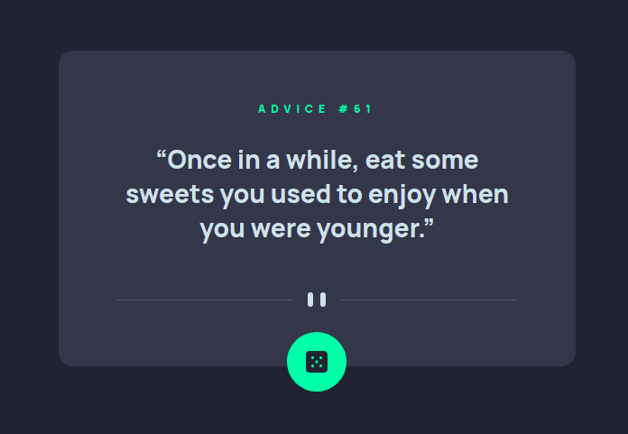

# Frontend Mentor - Advice generator app solution

This is a solution to the [Advice generator app challenge on Frontend Mentor](#). 

## Table of contents

- [Overview](#overview)
  - [The challenge](#the-challenge)
  - [Screenshot](#screenshot)
  - [Links](#links)
- [My process](#my-process)
  - [Built with](#built-with)
  - [What I learned](#what-i-learned)
  - [Continued development](#continued-development)
  - [Useful resources](#useful-resources)
- [Author](#author)
- [Acknowledgments](#acknowledgments)

## Overview

### The challenge

Users should be able to:

- View the optimal layout for the app depending on their device's screen size.
- See hover states for all interactive elements on the page.
- Generate a new piece of advice by clicking the dice icon.

### Screenshot

### Links

- Solution URL: [Click Here](https://your-solution-url.com)
- Live Site URL: [Click Here](https://your-live-site-url.com)

## My process

### Built with

- Semantic HTML5 markup
- CSS custom properties
- Flexbox
- CSS Grid
- Mobile-first workflow

### What I learned

Using fetch api to populate ui.

## Author

- Website - [Vaibhav Kumar Singh](https://vaib.carrd.co)
- Frontend Mentor - [@Vaib215](https://www.frontendmentor.io/profile/Vaib215)
- LinkedIn - [@Vaib215](https://www.linkedin.com/in/Vaib215)

